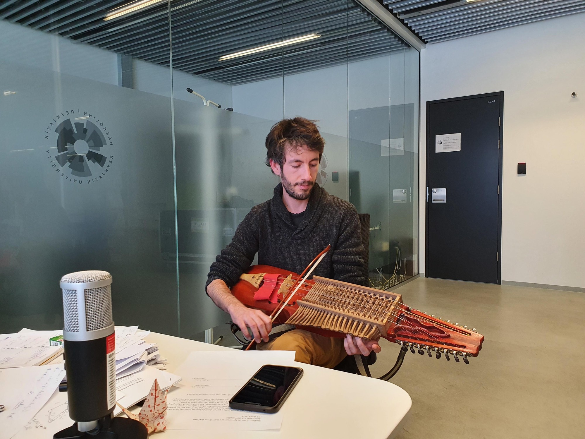

The nyckelharpa is a Swedish traditional instrument which consists in a viola equipped with a keyboard. As the viola, it is bowed, and one adjusts the height of the notes using keys, instead of directly pressing the strings with fingers. It is also endowed with sympathetic strings, which provide additional resonance. If you want to learn more about it, you can visit the [American Nyckelharpa Association website](http://www.nyckelharpa.org/).

<!--  -->

<!-- TODO: right link + image + swedish reference + French reference + video -->
